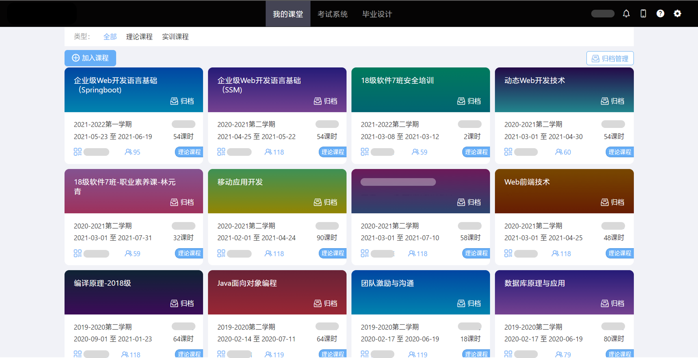

# 针对U+平台界面的优化

## 预览

### 优化前
- 主界面
  
- 作业
  
- 考试
  

### 优化后 (v3.0)
- 主界面
  
- 作业
  
- 考试
  

## 使用
使用Stylus插件载入CSS。
### 具体方法
1. 安装Stylus Chrome (或Edge) 插件；
2. 下载CSS文件，全选并复制； (注意编码)
3. 添加新样式；
4. 将模板删除并粘贴，完成。

## 历史版本预览

### v2.3

### v2.1

### v2.0

### v1.5

### v1.0

